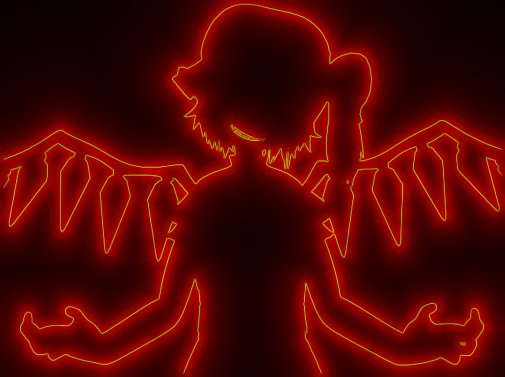

# bad-apple-light
- a wireframe & neon light version of the original video *BAD APPLE!!*
- related video: https://www.bilibili.com/video/BV1Cy411B7wn




### suggested environment

- `ubuntu22.04 LTS` for `x86_64`
- an NVIDIA GPU which supports CUDA11 (for example, GEFORCE RTX 3060Ti)
  - learn more: https://docs.nvidia.com/deploy/cuda-compatibility/


## prerequisite

- install `ffmpeg` and add it to `PATH`
- install  `CUDA11` with `nvcc` 
- `python>=3.12`, install python package `numpy`, `pillow`, `tqdm`


## usage

before running these instructions, we assume that you're at the root folder of this project.

### 1. compile `get_red_arr.so`

- **this step is not necessary on compatible machines**

```bash
pushd ./src/get_red_arr # change dir into folder "src/get_red_arr"
make all                # compile get_red_arr.so
popd
```

### 2. compile `get_var_arr.so`

- **this step is not necessary on compatible machines**

```bash
pushd ./src/get_var_arr # change dir into folder "src/get_var_arr"
make all                # compile get_var_arr.so
popd
```

### 3. generate `final.mp4`

```bash
pushd ./src   # change dir into folder "src"
bash split.sh # split mp4 into frames
make all      # generate output.mp4 and final.mp4
popd
```


## structure

- use pixel color variance in neighborhood to identify the boundaries: `src/get_var_arr/main.py`
  - `src/get_var_arr/get_var_arr.cu`: `get_var_arr(int n, int m, double*, double*)`
- neon light simulations: `src/get_red_arr/main.py`
  - `src/get_red_arr/get_red_arr.cu`: `get_red_arr(int n, int m, double*, double*)`
- main process: `src/gen.py`
